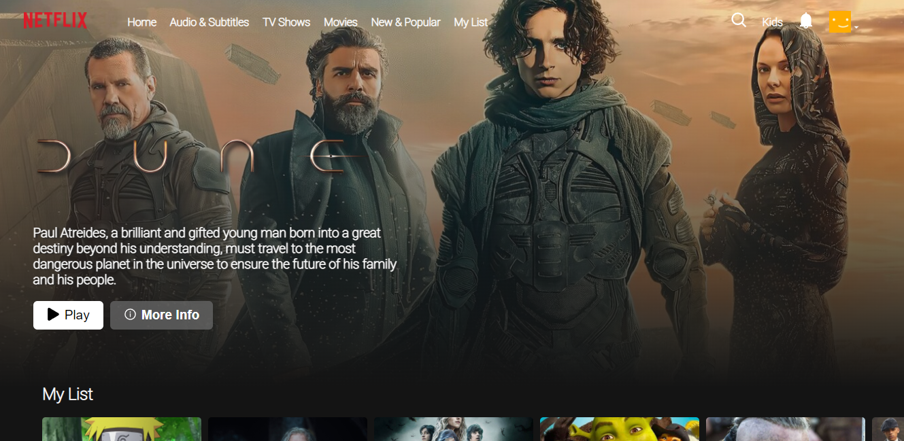
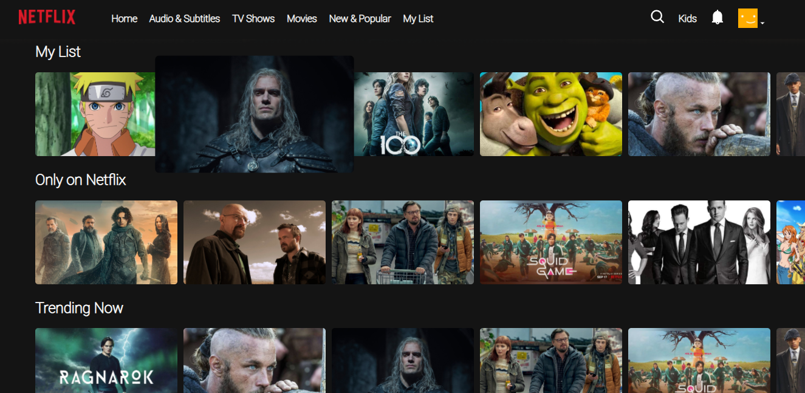
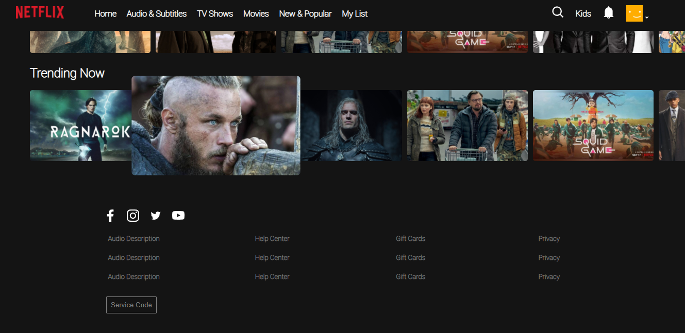
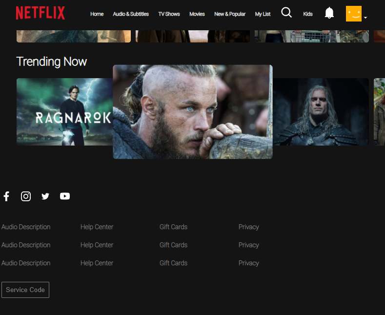

## About me
```python
<div
 <header>

   I am an Argentinian boy that loves programming and learn anything, 
   questions? I search in google, problems? I really like solve them!

 </header>
 <technologies>
   - [ ] Javascript
   - [ ] React
   - [ ] Redux
   - [ ] Node
   - [ ] Express
   - [ ] CSS
   - [ ] Sequelize - Postgres
 </technologies>

</div>
```

## This project
<div>
 <h1>Layout clon of netflix whit react and pure css</h1>

### At first sight
 
 
### Going down
 
 <hr/>
 
 
### Small view of responsive in pc
 

</div>
 
## Function Comodin

You need other technologies, tell me, i like learn more lenguages, write me and we are on board

```python
export default function Comodin (technologies) {
 if (you need other technologies) {
   I can learn those technologies
 }
}
```
## I awaiting your message!!
